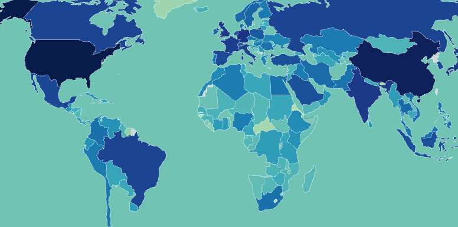

# Global Country Intelligence Map


A standalone HTML/CSS/JS single-page application for interactive country analytics powered by real public data sources. No build step required — runs entirely in the browser.



## Features

| Category | Highlights |
|---|---|
| **Map & Visualization** | Interactive choropleth world map, 10+ metric layers, zoom/pan, hover tooltips |
| **Country Details** | 25+ economic, social & safety indicators per country; GDP & crime trend charts |
| **Forecasting** | IMF forecast series + linear-regression fallback |
| **Decision Lenses** | Family Safety, Hazard Exposure, Job Fit, Macro Stability, Risk Pressure |
| **Comparison** | Side-by-side comparison table, sortable ranking table, global leaderboards |
| **Planning Tools** | Relocation budget planner, Visa/residency path finder, Country story mode |
| **Watchlists** | Custom threshold alerts stored in localStorage |
| **Export** | Download filtered dataset as JSON or CSV |
| **UX** | Dark mode, region filter, search, shareable URL snapshots |

<details>
<summary>Full feature list</summary>

- Hover tooltips on countries with live stats
- Click-to-pin details panel with country profile + key indicators
- Choropleth map metric switcher (GDP, adjusted net income, GDP per capita, population, UN crime rate, airlines count, airports count, life expectancy, unemployment, area)
- Natural hazard exposure map metric (composite score from EM-DAT + ND-GAIN)
- Macro and development metrics: inflation/debt/current account (IMF + World Bank), poverty and Gini (World Bank), tourism arrivals/receipts (UN Tourism/World Bank), WHO health, ND-GAIN vulnerability/readiness, EM-DAT disaster stats
- Region filter + search
- Top-country ranking table
- Country-vs-country comparison table
- GDP trend chart (2000 to latest available year)
- Crime trend chart from UN SDG API (indicator 16.1.1)
- Live weather panel on country click (Open-Meteo current conditions)
- Forecast mode panel (IMF projected series when available + linear fallback)
- Alert watchlists with user-defined threshold rules (saved in localStorage)
- Country change alerts scanner (selected country + watchlist, year-over-year triggers)
- Natural disaster timeline chart (EM-DAT events vs deaths by year)
- Natural hazard exposure lens (risk-level and component breakdown)
- Family safety lens (composite from crime/disaster/health/stability/readiness)
- Visa + residency path finder (pre-screen using regional mobility blocs + destination conditions; verify official rules)
- Job market fit by profession (macro-proxy model by profession profile)
- Best alternatives engine (finds substitute countries by cost/safety/jobs/resilience focus)
- Shareable snapshot links (stateful URL for filters/country/year/compare/forecast mode)
- Relocation planner with family/lifestyle parameters and multi-country comparison for moving decisions
- Export dataset as JSON or CSV

</details>

## Data sources (real)

| Source | Used for |
|---|---|
| REST Countries API | Primary country metadata |
| World Bank Countries endpoint | Fallback country metadata |
| World Bank Indicators API | GDP and other economic/social indicators |
| IMF DataMapper API | Inflation, debt (% GDP), current account (% GDP) |
| UN SDG API (`16.1.1`) | Intentional homicide rate trend by country |
| WHO Global Health Observatory API | Life expectancy snapshot |
| ND-GAIN public extract | Climate vulnerability/readiness snapshot (local cache) |
| EM-DAT country profiles (HDX) | Disaster events/deaths snapshot (local cache) |
| UN Tourism (UNWTO) | Tourism indicators (surfaced via World Bank) |
| OpenFlights open dataset | Airlines and airports by country |
| Open-Meteo API | Live weather by country centroid coordinates |
| Public world GeoJSON | Map geometry |

## Run locally

A local HTTP server is required (the Fetch API does not work over `file://`).

```bash
# Option A — Python (no install needed)
python3 -m http.server 8080

# Option B — Node.js
npx http-server .

# Then open:
# http://localhost:8080
```

## Deploy to GitHub Pages

The repository includes a GitHub Actions workflow (`.github/workflows/deploy.yml`) that automatically deploys to GitHub Pages on every push to `main`.

To enable it:
1. Go to **Settings → Pages** in your repository.
2. Set the **Source** to **GitHub Actions**.
3. Push to `main` — the workflow will handle the rest.

You can also trigger a manual deployment from the **Actions** tab using the **workflow_dispatch** trigger.

## Files

```
Global-Country-Intelligence-Map/
├── index.html          — Main application shell
├── styles.css          — Application styles (dark mode included)
├── app.js              — Complete application logic
├── about.html          — About page
├── disclaimer.html     — Legal disclaimer
├── about-map-reference.png
├── data/
│   ├── imf_snapshot.json     — IMF economic forecast cache
│   ├── who_snapshot.json     — WHO health indicators cache
│   ├── ndgain_snapshot.json  — ND-GAIN climate vulnerability cache
│   └── emdat_snapshot.json   — EM-DAT disaster data cache
└── .github/
    └── workflows/
        └── deploy.yml  — GitHub Pages deployment workflow
```

## Notes

### Net worth
There is no single globally standardized, always-updated country "net worth" API.
This app uses **World Bank indicator `NY.ADJ.NNTY.CD` (Adjusted Net National Income)** as a transparent proxy.

### Military aircraft
Military aircraft counts are not available from a free global public API with consistent country-level coverage.
This app does **not** invent or fabricate military aircraft counts.

### Performance
IMF/WHO/ND-GAIN/EM-DAT are shipped as local snapshot JSON files in `data/` to keep startup fast.
To refresh the cache, replace those files with updated exports from the source APIs.

### Relocation planner
Relocation budget is an analytic estimate, **not legal or financial advice**.
It uses World Bank household consumption and PPP price-level proxies plus risk/suitability adjustments.

### Visa / residency path finder
There is no single free, complete global API for visa + long-term residency policy.
The tool provides a **pre-screen score** from regional mobility blocs and destination indicators.
**Always confirm final requirements with official immigration/embassy sources.**
